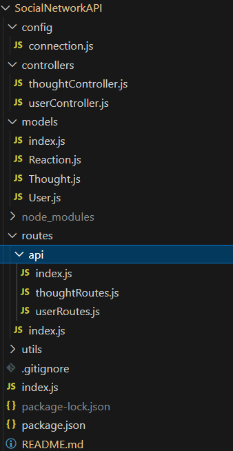
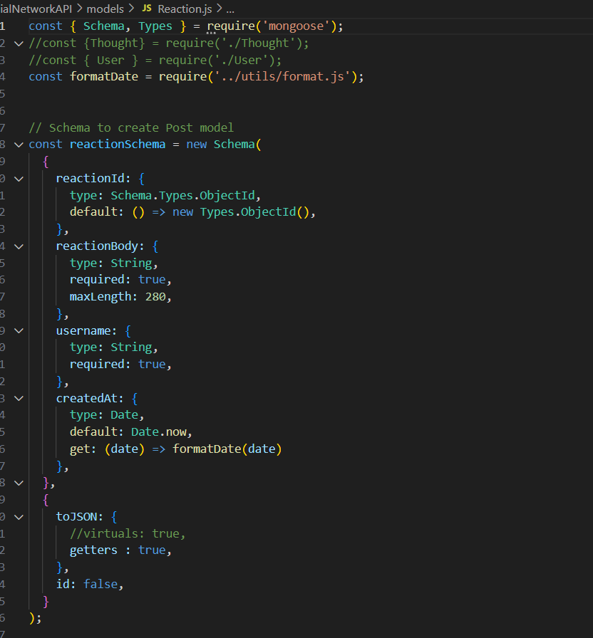
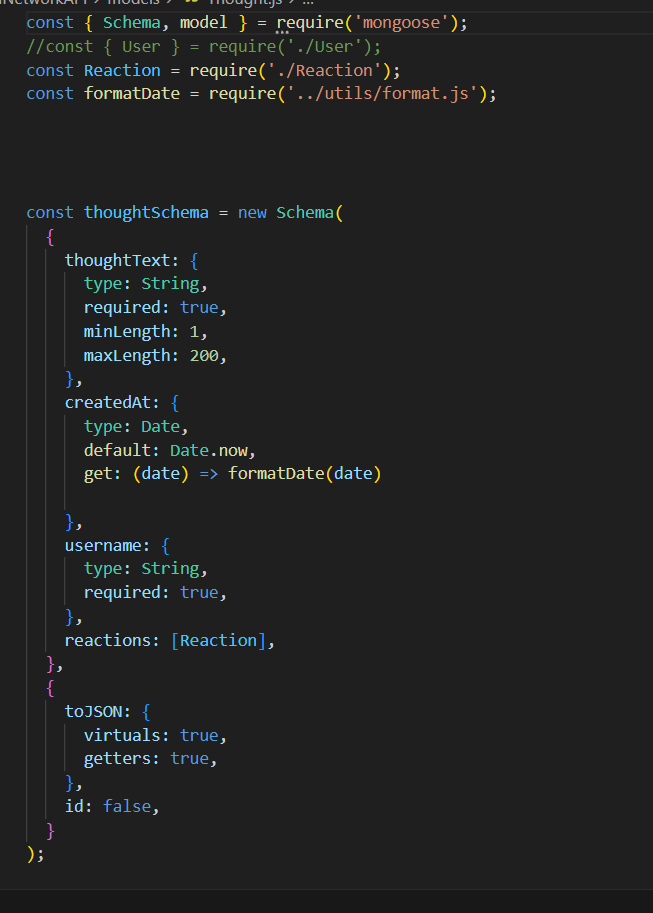
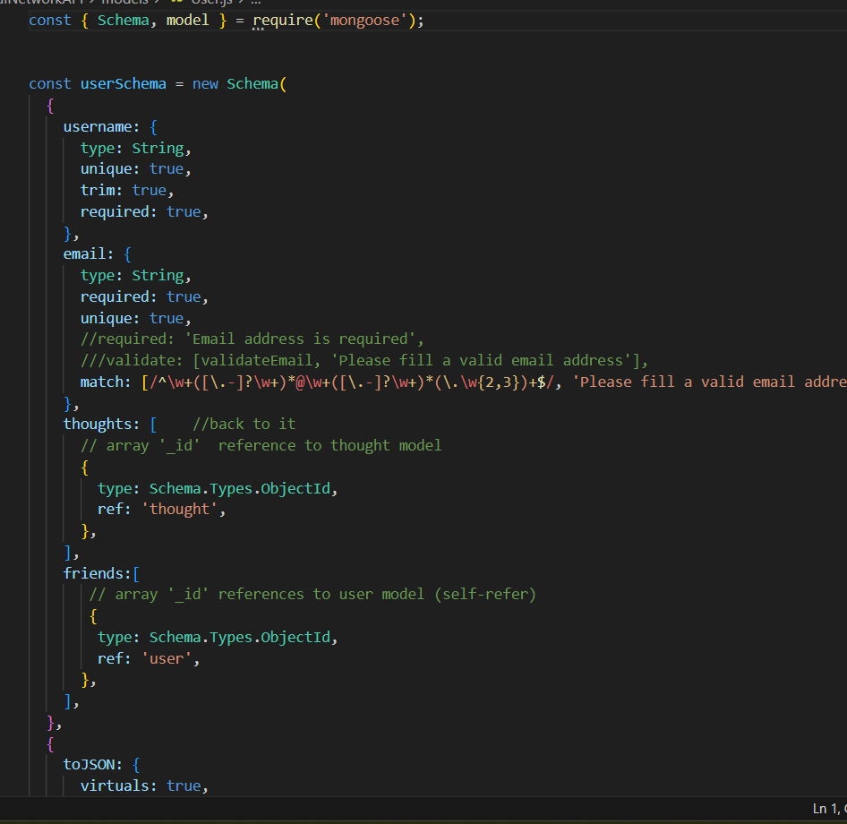
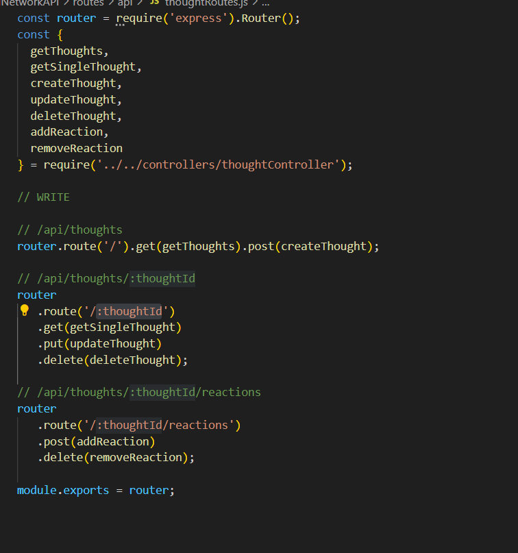
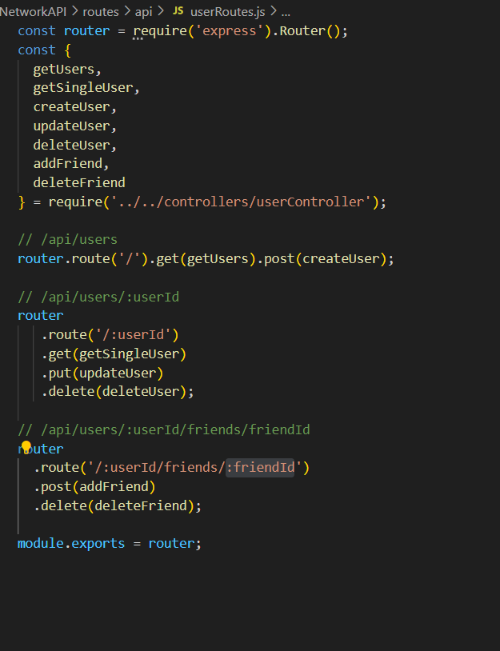
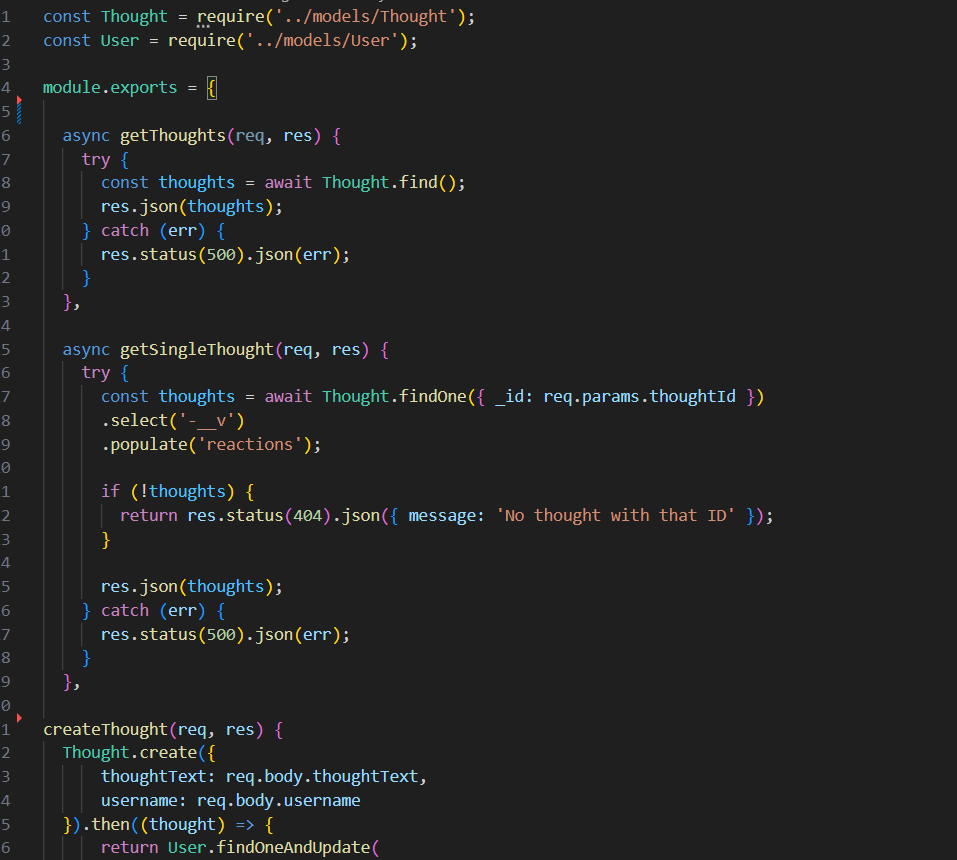
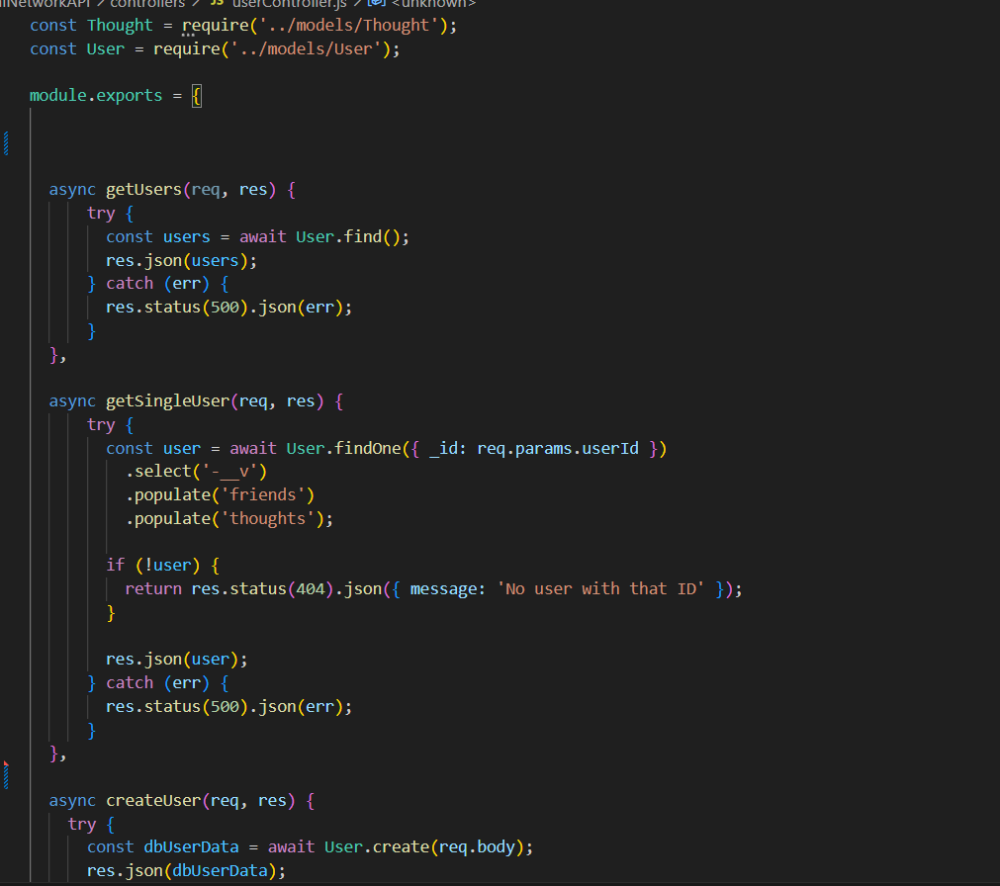
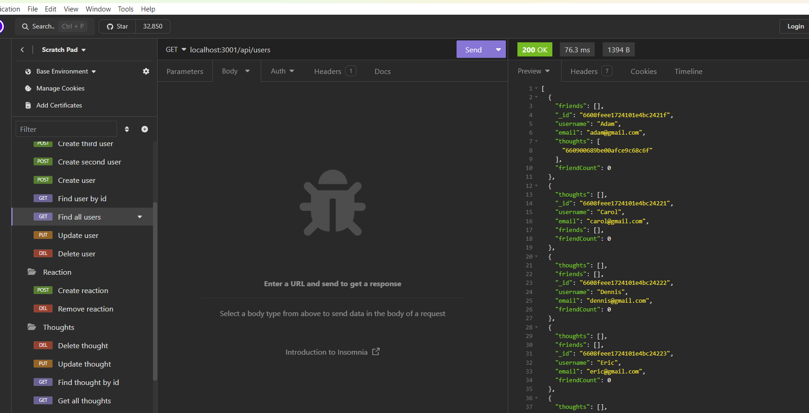
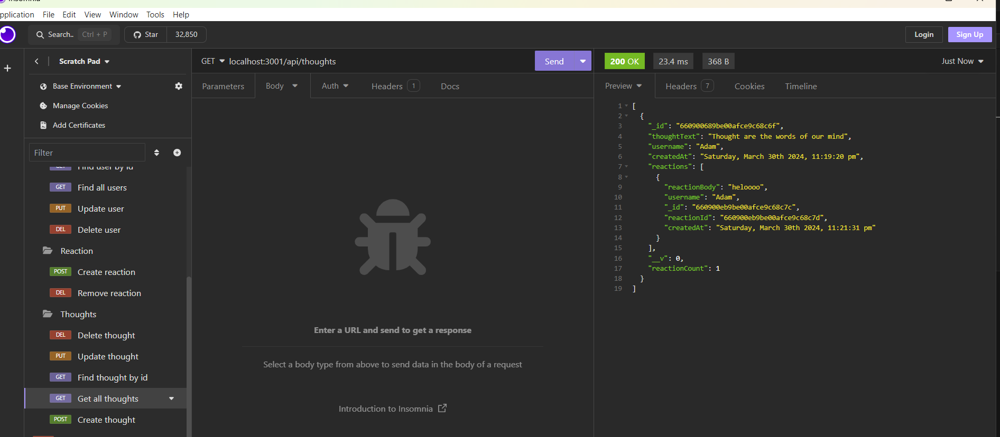

# SocialNetworkAPI

## Table of Contents (Optional)

- [Description](#description)
- [Installation](#installation)
- [Usage](#usage)
- [Credits](#credits)
- [License](#license)

## Description

I learn Mongoose Database and how create it and connected between mongoose,rout,controller and server,I build this project to build more organized database and easy to create ,view and update. 

- What problem does it solve?
1- enter the command to invoke the application using (npm run seed) and (npm run start).
2- open API GET routes in Insomnia for users, thoughts and reaction and adding formatted JSON from some routes .
3- test API POST, PUT, and DELETE routes in Insomnia and be able to successfully create, update, and delete users and thoughts in my database.
4- when open Insomnia will displayed four folders (users, thoughts, freinds and reaction)
5- each folder has a test API (data GET ,POST, PUT, and DELETE) so data can (View ,create, update, and delete from database)

## Installation

The project has many installation process for (package.json) and it's install using this command in terminal "npm init", install express server using (npm install express) or (npm i) , check database seeds using (npm run seed) and run the project using (npm run start)

## Usage
After install all packages , run the project using "npm run start" , then open Insomnia

github :  https://github.com/omeraus6/SocialNetworkAPI

image 1: project folder

image 2: 

image 3: 

image 4: image 2-4: project code

image 5: project video run

image 6: project in Insomnia

image 7: 

image 8: image 2 - 8 mongooes DB, controller and routes code

image 9:  Insomnia Routes

image 10: Insomnia Routes

image 10: Insomnia Routes

## Credits

Thank you for tips and sugestion from Bootcamp instructors and classmates, I hava used https://developer.mozilla.org/en-US/docs/Web/CSS/grid-template to reserch information.

## License

Please refer to the LICENSE in the repo.